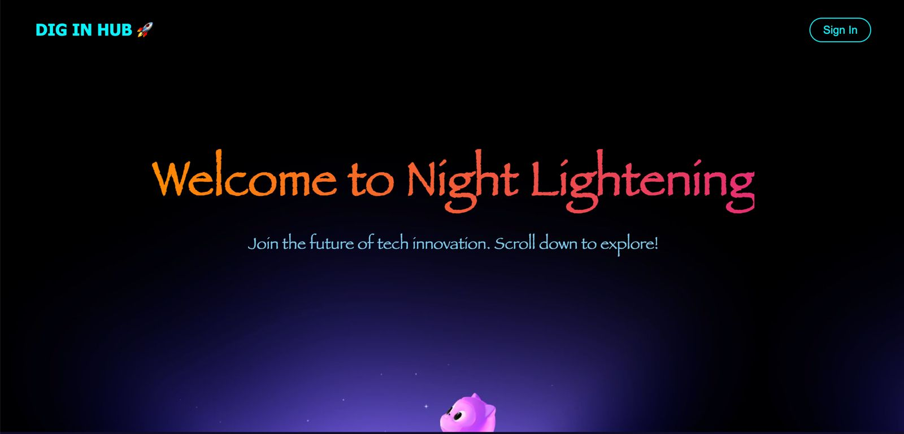
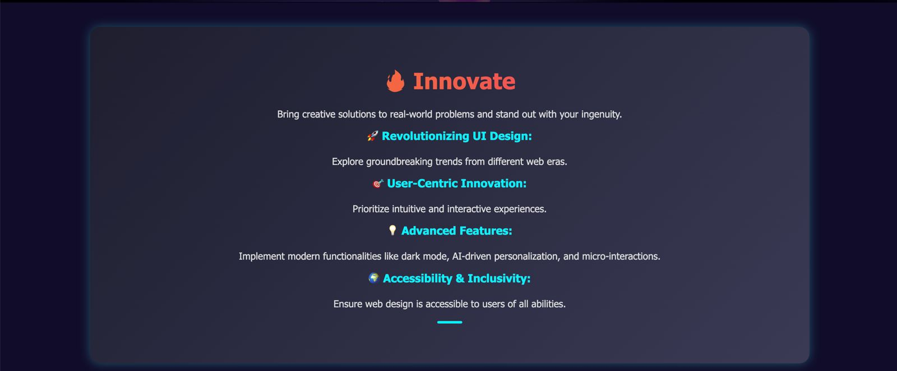
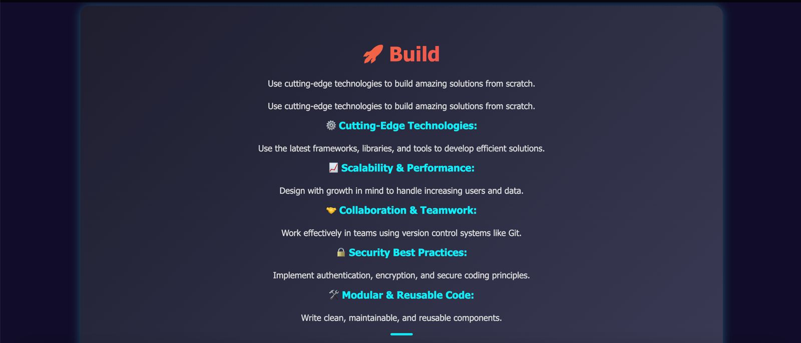
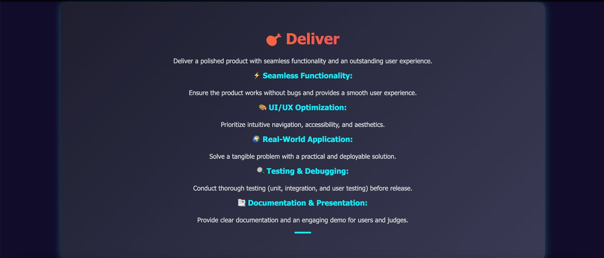
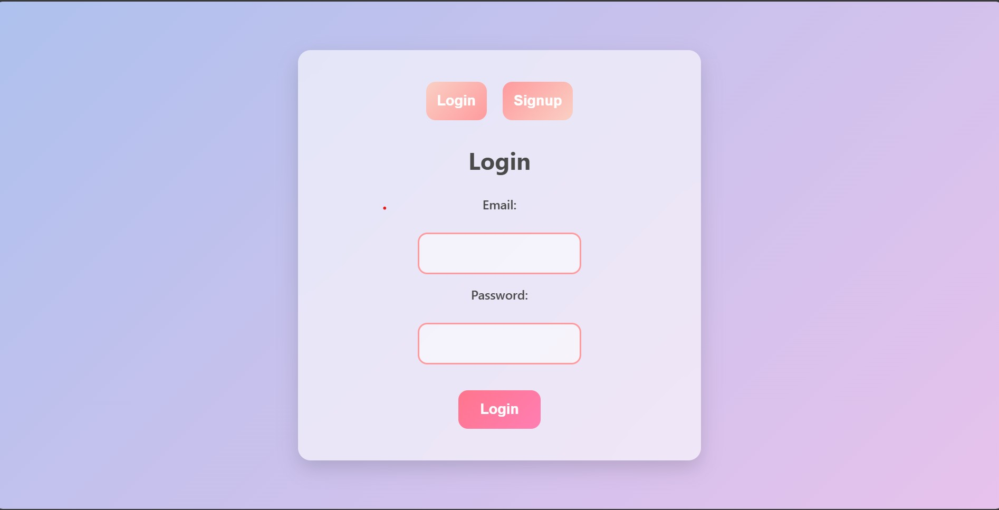
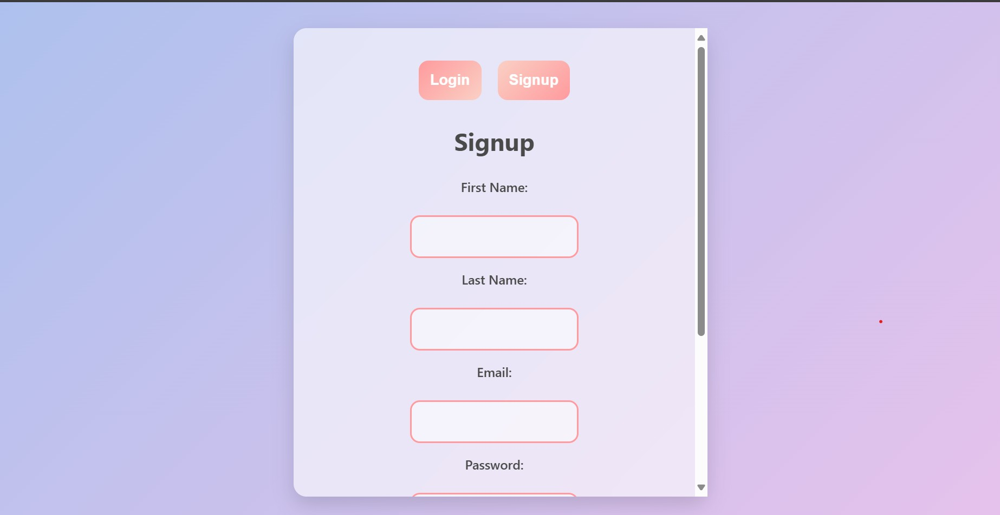
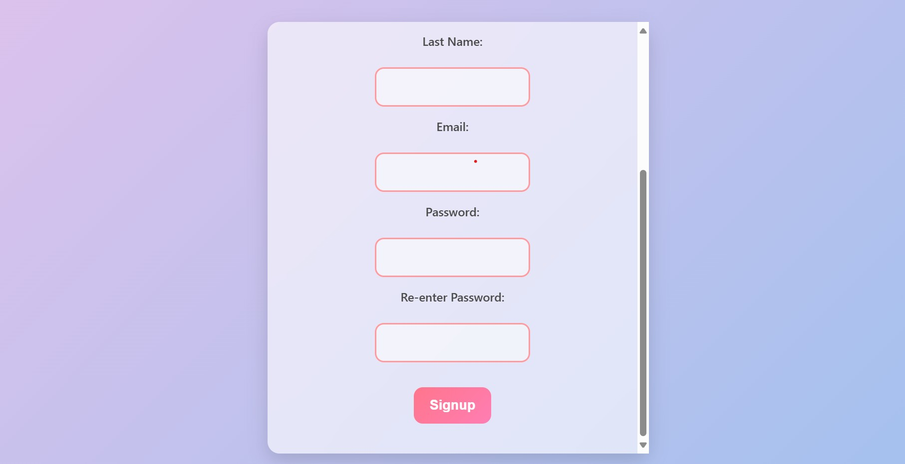
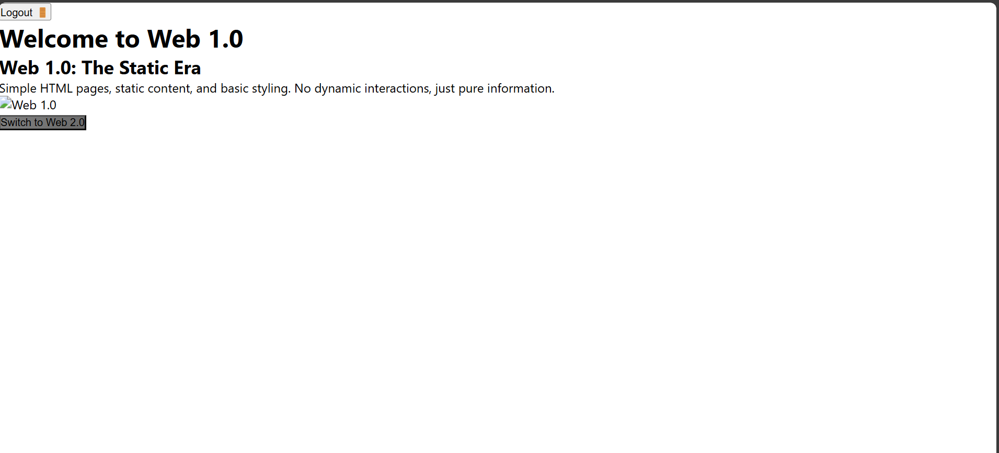
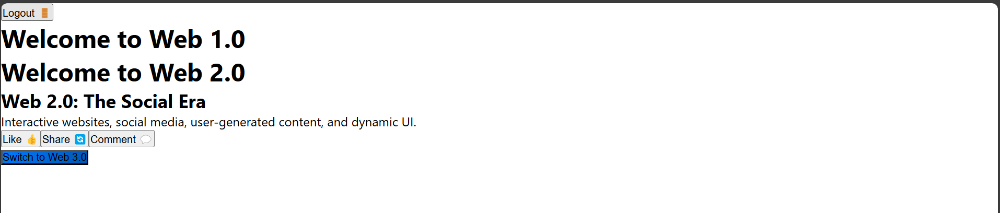

# 🎉 DevX Web Challenge 🚀  

Welcome to our project submission for the **DevX Web Challenge**! Below, you'll find all the details about our team, tech stack, setup instructions, and features implemented.  

---

## 🏆 Event Name  
**DevX Web Challenge**  

## 👨‍💻👩‍💻 Team Name  
**Night Lightning**  

---

## 🛠️ Tech Stack Used  
Our project is built using the following technologies:  

✅ **Frontend:** React.js, Tailwind CSS  
✅ **Backend:** Node.js, Express.js  
✅ **Database:** MongoDB  
✅ **Other Tools:** Vercel, GitHub, Postman  

---

## ⚙️ Setup Instructions  

Follow these steps to set up and run the project locally:  

### 🔹 Clone the Repository  
```bash
git clone https://github.com/your-repo.git
```
## for getting the Output

### The vercel https://webdevx-eight.vercel.app/

### The backend https://webdevxback.onrender.com

## Screenshots




























## Deployment Error : undefined/ in fetching url

In only vercel. In localhost its working fine

``` npm run build ```
``` npm run start ```